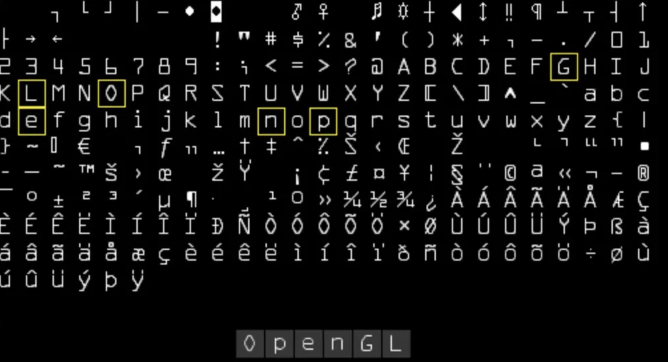

相机本质上是一个**数学变换矩阵**

> “我去，我看到大地在极速上升”，“那他妈是跳楼”

在现实中，如果拿起相机向上移动，镜头中的世界看起来则是像下移动

这便是摄像机矩阵的核心逻辑：**逆变换**
我们做出以下定义
- **游戏世界**：是不动的，静止的，在游戏程序中定义，相对坐在屏幕前的自己来说，这个世界是抽象的，是不可见的
- **摄像机**：定义观察者的位置，视野
- **渲染**：将整个世界**反向**移动、旋转、缩放，使其恰好落在屏幕的矩形框内

**游戏世界->摄像机->渲染** 这整个过程中，相机起到的作用就是通过相机矩阵运算将世界搬运到屏幕前，让抽象的世界，实在的显示在屏幕上

## 重回线性代数
图形学最迷人的地方莫过于矩阵变化，虽然我大学线性代数是60分被老师捞起来的，但在图形学中，我不需要像考试那样手算矩阵乘法，计算机很擅长做这件事情而我们只需要想象矩阵乘法是对物体的一系列指令。

接下来，想象这样一个情景：你坐在一个平坦的、干净的地面上，地面放了一块木板，木板上放置了一张白纸，你拿起笔，在纸上画了一个小人。

事实上，白纸就是我们的**游戏世界**，而小人，则是世界中的玩家，木板就是屏幕，而纸上的每个墨点，都是一对**坐标(x,y)**

而我们可以用手，让纸在木板上平移，旋转，缩放（请你假设这就是一个可以随意缩放的纸张）
矩阵乘法就是“动作叠加”。
如果想“先平移，再旋转”，在数学上就是 **平移矩阵 * 旋转矩阵**。最终得到一个“**混合矩阵**”，它包含了这两个动作。

## 相对论
到这里，可能会有些绕，有些反直觉，前面我们明明提到了，世界是不动的，静止的，但是为什么被代指为**游戏世界**的白纸，被我们随便移动，旋转，缩放？

想象一下你坐在高铁上，看着窗外的树。树是种在地里的，树没动，是我坐的车在动。但我们小学二年级就学过，当我们转换参考系，我坐在椅子上一动没动，是窗外的树在地往后飞。而显卡（GPU）就是那个坐在椅子上、死脑筋的乘客。  

显卡不懂什么是“摄像机飞过去了”，显卡只知道：**屏幕（木板）永远不动，永远在 (0,0)**。

所以，为了让显卡相信“摄像机向右移动了10cm”，我们只能在数学上欺骗它把整个世界向左搬运 10cm。
## 核心原理
假设我们要实现，让摄像机看向小人，也就是世界上的某一个位置
### Translation
把纸张一把拽过来，让纸上画的那个“小人”（玩家），刚好对准桌子的左上角（数学原点 0,0）。这一整个过程，从相对的视角来看，就行反向将木板移动，而纸不动
### Roation
用图钉按住桌角的 (0,0) 点（也就是小人的位置），把整张纸旋转一个角度。  
模拟摄像机的旋转动作。  而摄像机想顺时针旋转，我们就得把世界逆时针转。因为小人被钉在原点，所以他只是原地自转，周围的世界则绕着他转
### Scale Zoom
依然按住木板的 (0,0) 点，把纸张拉大或缩小
### Translation Origin
这是最后一步，也是最关键的一步。把这张已经在木板加工好（旋转、缩放完毕）的纸，平移推到木板的正中央

这整个过程用矩阵乘法表示就是：
$$ P_{final} = P_{world} \times M_{translate(-pos)} \times M_{rotate(-rot)} \times M_{scale(zoom)} \times M_{translate(origin)} $$

使用代码来描述一个摄像机就会是这样
``` cs
public class Camera
{  
    public float Zoom { get; set; } = 1.0f;  
    public Vector2 Origin { get; set; }  
  
    public Matrix GetViewMatrix()  
    {
        var transform = Matrix.CreateTranslation(new Vector3(-Position, 0)) *  
                        Matrix.CreateRotationZ(-Rotation) *  
                        Matrix.CreateScale(new Vector3(Zoom, Zoom, 1)) *  
                        Matrix.CreateTranslation(new Vector3(Origin, 0));  
  
        return transform;  
    }    
    public Vector2 ScreenToWorld(Vector2 screenPosition)  
    {
        return Vector2.Transform(screenPosition, Matrix.Invert(GetViewMatrix()));  
    }  
      
    public Vector2 WorldToScreen(Vector2 worldPosition)  
    {
	    return Vector2.Transform(worldPosition, GetViewMatrix());  
    }
}
```
> 这里的旋转矩阵和平移矩阵使用负符号就是前面说到的相对的变换


