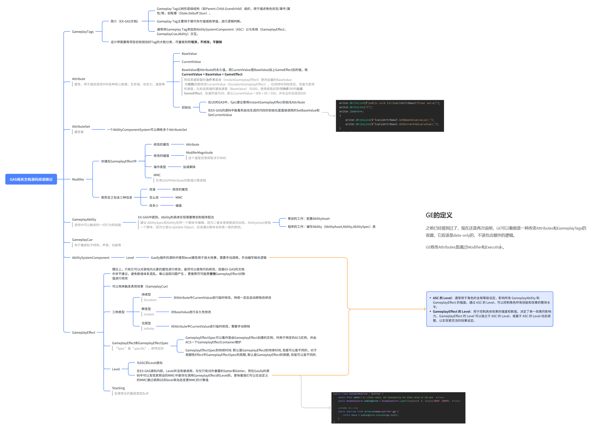
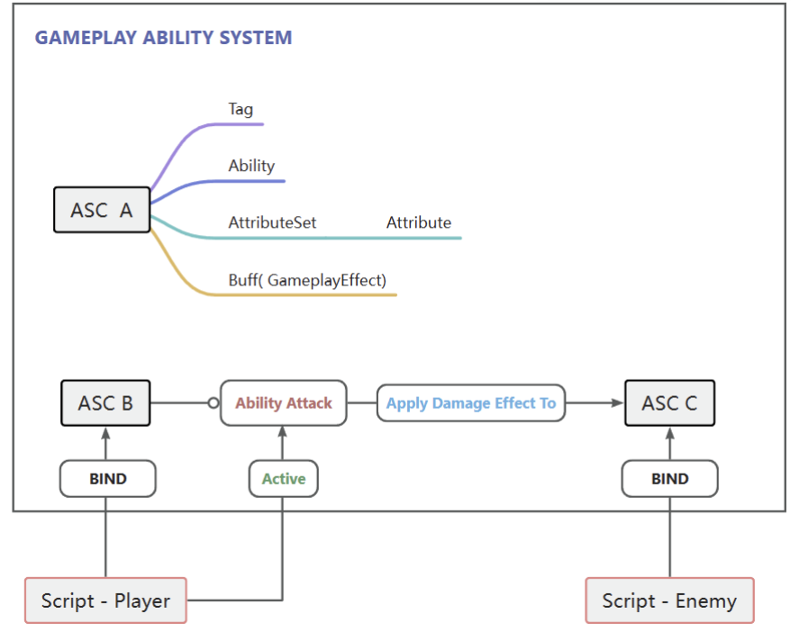
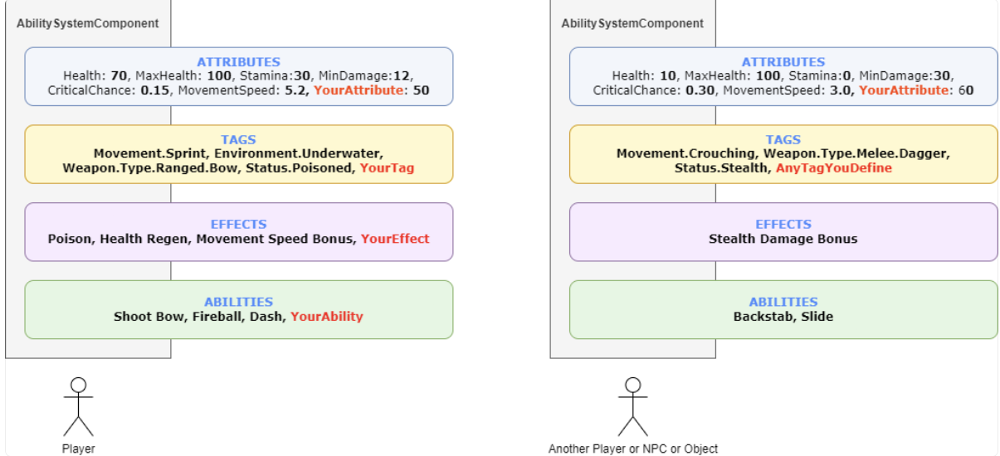
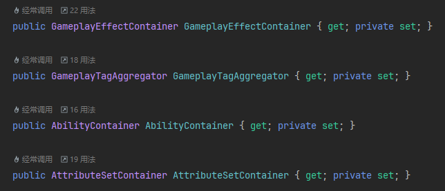
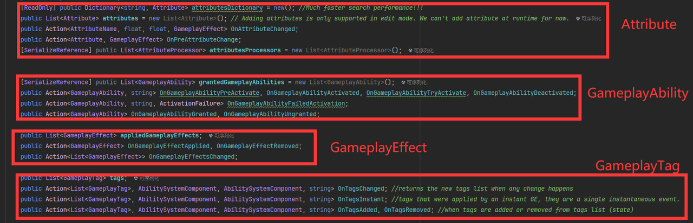

# GAS框架

## 概述

GameplayAbilitySystem（简称GAS）是由UE发布的一个插件，以下是官方文档的解释

> GameplayAbilitySystem是一个高度灵活的框架，可用于构建你可能会在RPG或MOBA游戏中看到的技能和属性类型。你可以构建可供游戏中的角色使用的动作或被动技能，使这些动作导致各种属性累积或损耗的状态效果，实现约束这些动作使用的"冷却"计时器或资源消耗，更改技能等级及每个技能等级的技能效果，激活粒子或音效，等等。简单来说，此系统可帮助你在任何现代RPG或MOBA游戏中设计、实现及高效关联各种游戏中的技能，既包括跳跃等简单技能，也包括你喜欢的角色的复杂技能集。

其包含以下几个核心概念：

* AbilitySystemComponent

* GameplayTag

* GameplayEffect

* GameplayAbility

* GameplayCue

**GAS的运行逻辑**

***

## AbilitySystemComponent

AbilitySystemComponent（简称ASC）是GAS运行的基本单位，是GAS执行大多数事情的起源，他可以代表一个角色，敌人，Boss等一切**实体**

**Attributes，Tags，GameplayEffects，GameplayAbility**都应用于ASC，也就是说ASC持有这些东西的**容器，以下是EX-GAS和GASify的ASC的源码**

***

## GameplayTag

GameplayTag用于分类和描述对象的状态，以下是EX-GAS的解释：

> * Gameplay Tag以树形层级结构（如Parent.Child.Grandchild）组织，用于描述角色状态/事件/属性/等，如眩晕（State.Debuff.Stun）。
>
> * Gameplay Tag主要用于替代布尔值或枚举值，进行逻辑判断。
>
> * 通常将Gameplay Tag添加到AbilitySystemComponent（ASC）以与系统（GameplayEffect，GameplayCue,Ability）交互。

Tag的目的就是简化传统的布尔值判断，可以用于简单的状态描述，以及处理复杂的技能效果交互

以英雄联盟举例，**一个被“击晕”的角色**可以被分配一个“**State.Debuff.Stun**”的游戏标签来代表它的当前状态

或者当我们玩亚索残血被追击时，被寒冰攻击到（**减速Buff**），然后被提莫攻击到（**中毒Buff**），我们使用**净化**解除这些效果并成功逃生，净化的效果是：**移除身上的所有限制效果和召唤师技能的减益效果**，我们把这些减益效果和限制效果都称作**Debuff** 那么整个过程就非常的简单

传统的做法，我们需要让**减速类**和**中毒类**都实现**Debuff接口**，然后判断实体是否持有实现了Debuff接口的对象并一一将他们删除，但是这属于具体的实现，可能会在代码中写下大量的if-else的判断，如果还有更多复杂的效果，更是增加了代码的复杂度，而GameplayTag就解决了这个问题，我只需要为减速效果和中毒效果添加Tag（中毒:Debuff.Poison，减速:Debuff.SpeedDown），具体的判断逻辑则是写在GAS框架内部，开发者不需要编写额外的实现

不过需要注意的是，在**项目初期**，设计师就应该对Tag进行大致分类以及设计，并在后期尽可能做到**只增添，不修改，不删除**

以下是一些其他的Tag的例子：

> Enemy.Boss", "Weapon.Ranged", "Environment.Underwater", "Status.Poisoned","State.Jump"

***

## Attribute

Attribute用于描述游戏中的各种核心数据，称作属性，例如生命值，魔法值，耐久值，攻击力，速度等等等
一个Attribute存在两个值
* **BaseValue 永久值**
* **CurrentValue 当前值**

其中的关系为**CurrentValue = BaseValue + GameplayEffect**

例如英雄联盟的**治疗术**直接（InstantGameplayEffect）更改血量的**BaseValue**

而**疾跑**则是修改CurrentValue（DurationGameplayEffect），在持续时间结束后，恢复为原来的速度，比如说英雄的基础速度（BaseValue）为500，使用疾跑后获得**持续**5秒的**加速GameplayEffect**，加速的值为50，

那么

**CurrentValue = 500（BaseValue） + 50（GameplayEffect） = 550**

并在五秒后变回500

在这里会有一个误区就是会误将BaseValue当作其Attribute的最大值，对于可以变更的最大值或最小值应该单独定义一个Attribute，例如已经定义了一个生命值（Hp）的属性，如果有一些效果需要获取到最大生命值（例如一些治疗效果：恢复最大生命值的30%或者UI上要根据当前生命值和最大生命值的比例来显示生命值），这个时候就需要单独定义一个Attribute（MaxHp）

Attribute还有一个重要的概念叫做AttributeSet（属性集)，它是属性的集合，一个ASC可能有一个或多个AttributeSet，例如有以下属性
* 生命值
* 速度
那么我们就可以定义一个**人物**的属性集，其包含生命值和速度，然后我们定义一个可以被破坏的**石头**，其属性集就只包含生命值这一个属性而不需要速度这个属性

**属性集的设计可以比较随意，但是更推荐一个单位只有一个属性集**

***

## GameplayEffect

GAS的一切数值交互都基于GameplayEffect，简单来说就是一切Attribute的变化都基于GameplayEffect，虽然在代码中可以手动修改属性的值，但并不推荐这样做，避免数值体系混乱，难以追踪问题产生 ，更推荐尽可能**只使用**GameplayEffect对数值进行修改

GameplayEffect存在以下三种类型：

| 瞬发型 | Instant  | 对Attribute中的BaseValue进行永久性修改              |
| --- | -------- | ----------------------------------------- |
| 持续型 | Duration | 对Attribute中CurrentValue进行临时修改，持续一定后自动移除修改 |
| 无限型 | Infinite | 对Attribute中CurrentValue进行临时修改，需要手动移除      |

---
### Modifier

Modifier是一个重要的概念，存储在GameplayEffect中，负责GameplayEffect的数值计算逻辑，简而言之包含三种信息：**改谁，怎么改，改多少**

Modifier包含了**修改的属性，幅值，操作类型，MMC**
* **修改的属性**：指的是GameplayEffect作用对象被修改的属性
* **幅值Magnitude**：修改器的基础数值
* **操作类型**：是对属性的操作类型，加减乘除覆盖
* **MMC**：计算单位，Modifier的核心

简单来说，就是向MMC中输入一个数值，MMC可以返回一个数值，并根据操作类型作用于需要修改的属性上，而Magnitude是否使用则取决于MMC的具体实现，开发者可以自定义MMC

如果不使用MMC，则默认使用Magnitude作为返回的数值

一个GameplayEffect可以有多个Modifier，其执行顺序是按照其添加顺序

### Level

Level属性用于放大效果，需要手动调用，手动编写相关逻辑

在EX-GAS源码内部，Level并没有被调用，仅仅只有对外暴露的Setter和Getter，而在Gasify的源码中可以发现其预设的MMC中是存在调用GameplayEffect的Level的，意味着我们可以在自定义的MMC通过调用GE的level来动态变更MMC的计算值

## GameplayAbility

GameplayAbility是AbilitySystemComponent可以触发的一起行为和技能，通常由程序编写其对应的逻辑，Ability的业务逻辑取决于游戏类型和玩法

> 引用至EX-GAS的文档：Ability的具体实现需要策划和程序配合。 这并不是废话，而是在EX-GAS的Ability制作流程中，确确实实的把策划和程序的工作分开了：
>
> * 策划的工作：配置AbilityAsset
> * 程序的工作：编写Ability（AbilityAsset,Ability,AbilitySpec）类

## GameplayCue

GameplayCue是一个用于播放游戏提示的类，它的作用是在游戏运行时播放游戏效果，比如播放一个特效、播放一个音效等，与GameplayAbility类似， Cue也是需要程序开发人员大量实现的，毕竟游戏不同导致游戏提示千变万化。

## 参考资料

[GitHub - No78Vino/gameplay-ability-system-for-unity: Gameplay-Ability-System For Unity](https://github.com/No78Vino/gameplay-ability-system-for-unity/tree/EX-GAS-1.0?tab=readme-ov-file)

[GitHub - BillEliot/GASDocumentation\_Chinese](https://github.com/BillEliot/GASDocumentation_Chinese?tab=readme-ov-file#concepts-gt)

[feliperoddd.gitbook.io](https://feliperoddd.gitbook.io/gasify)

[sjai013/unity-gameplay-ability-system](https://github.com/sjai013/unity-gameplay-ability-system/wiki)

