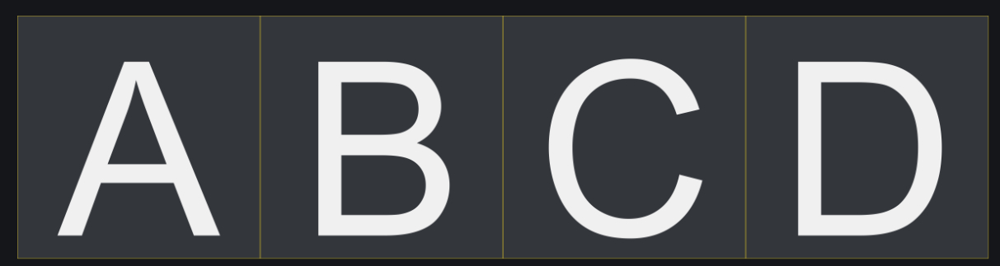
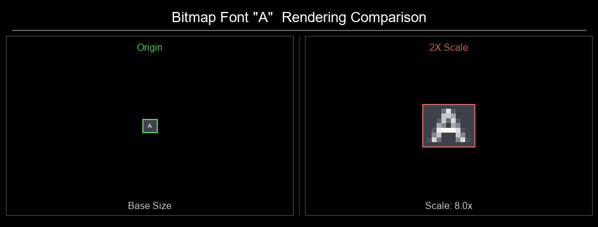
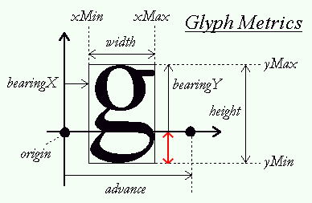
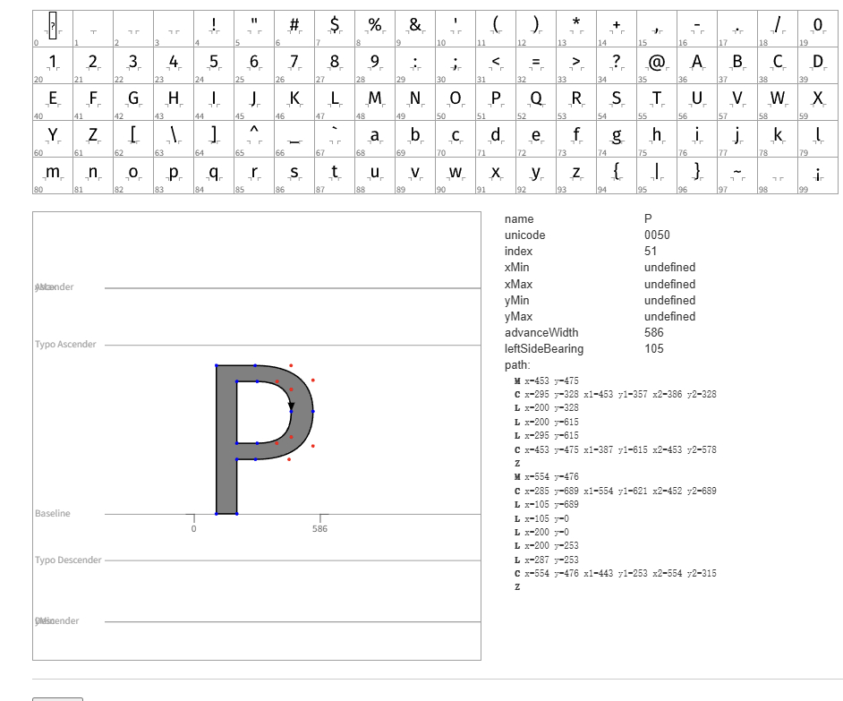
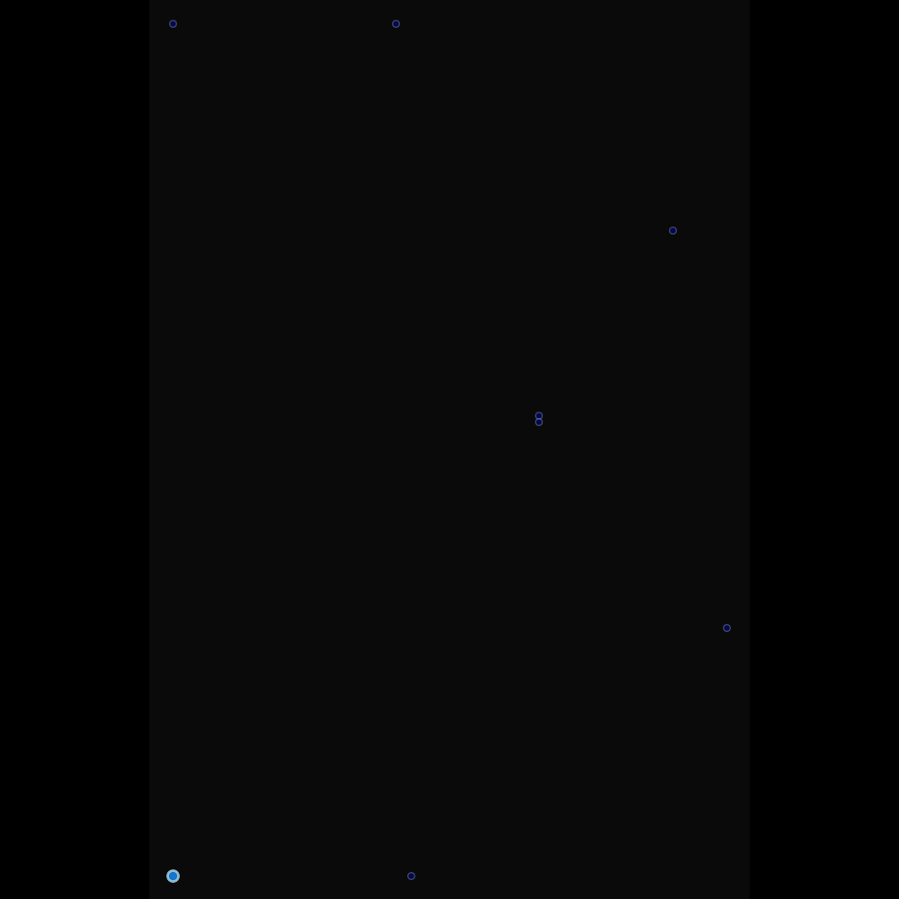
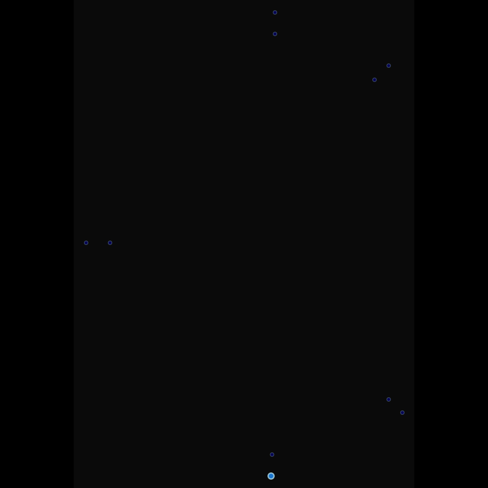
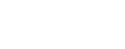
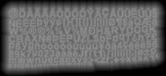

## 前言
文本渲染在游戏中处处可见，在各种游戏引擎中对文本渲染有一定支持，但实现原理肯定是有一定的差异，不同原理之间性能和效果表现也会有一定差异。本文则主要聚焦于不同文本渲染的方式和原理。
## 光栅模型
早期最经典、最传统的图形渲染方式。我们知道，计算机图像在画面中的显示，是通过输出像素点在显示器上依次排布的结果，那么根据这个原理，最简单最直接能想到的方式就是像渲染普通的图片一样，将我们要用到的字体预先输出到一张贴图中，在使用时，根据要输出的文本，找到对应的字符的位置，将其**取出来**进行渲染。


这种方式我们成为**Bitmap Font**。字体的字符称作一个**字型（Glyph）**，而字型则关联着一个特定的矩形区域，简单来说，字型与矩形区域的关系就是一个键值对，就像这样：
```
[A] -> [0 , 0, 12, 12]
[B] -> [12 , 0, 24, 12]
[C] -> [24 , 0, 36, 12]
[D] -> [48 , 0, 48, 12]
```

一般来说，我们使用一个配置文件来关联字型与矩形区域，在程序想要渲染某个文字时，加载该配置文件，获取到该文字对应的矩形区域，将这个矩形区域的图片画出来，就成功渲染了文本。

因为文本贴图是预渲染，预光栅化的，所以我将其成为**光栅模型**。

### 优点
- 实现容易，原理简单
- 渲染效率高，因为字符图集已经提前生成好了，在渲染时只需要读取对应的纹理信息进行渲染即可
### 缺点
- 不够灵活，当要适配多种字体大小，样式等效果时，需要额外生成一整套图集，同时也很占空间
- 当遇到需要对字体进行缩放或旋转的情况时，很容易看到边缘的像素化情况

## 矢量模型
就像PS和AI的关系一样，有位图处理的方式，那么也很容易想到通过矢量的方式来渲染文本。

> LearnOpenGL：
> 
> FreeType是一个能够用于加载字体并将他们渲染到位图以及提供多种字体相关的操作的软件开发库。它是一个非常受欢迎的跨平台字体库，它被用于Mac OS X、Java、PlayStation主机、Linux、Android等平台。FreeType的真正吸引力在于它能够加载TrueType字体。
> 
> FreeType is a software development library that is able to load fonts, render them to bitmaps, and provide support for several font-related operations. It is a popular library used by Mac OS X, Java, PlayStation, Linux, and Android to name a few. What makes FreeType particularly attractive is that it is able to load TrueType fonts.

FreeType所做的事：加载TrueType字体->为字形生成位图->计算几个[FreeType的度量值](FreeType%E7%9A%84%E5%BA%A6%E9%87%8F%E5%80%BC.md)
>用于描述FreeType生成字型位图的大小和位置
?
每一个字形都放在一个水平的基准线(Baseline)上（即上图中水平箭头指示的那条线）。一些字形恰好位于基准线上（如’X’），而另一些则会稍微越过基准线以下（如’g’或’p’）。这些度量值精确定义了摆放字形所需的每个字形距离基准线的偏移量，每个字形的大小，以及需要预留多少空间来渲染下一个字形


以下，是一些关于度量值的描述

| 属性       | 生成位图描述                            |
| -------- | --------------------------------- |
| width    | 位图宽度（像素）                          |
| height   | 位图高度（像素）                          |
| bearingX | 水平距离，即位图相对于原点的水平位置（像素）            |
| bearingY | 垂直距离，即位图相对于基准线的垂直位置（像素）           |
| advance  | 水平预留值，即原点到下一个字形原点的水平距离（单位：1/64像素） |
### 字体格式
FreeType 加载矢量字体（TrueType）来渲染文本
- **ttf**：TrueType Font 是 Apple 公司和 Microsoft 公司共同推出的字体文件格式
- **otf**：OpenType Font 是 TTF 的升级版，而 OTF 是采用的是 PostScript 曲线，支持 OpenType 高级特性的更高级字体。
- **ttc**：TTC 就是几个 TTF 合成的字库，字库中的字体大部分字都一样，共享笔画数据，个别字符有差异。

字体格式有多种，但是基本都是通过绘制字体控制曲线，使用[opentype.js glyph inspector](https://opentype.js.org/glyph-inspector.html)可以查看不同字体的字型信息
图中蓝色点表示曲线**轮廓点**，红色点表示曲线**控制点**，熟悉相关设计软件使用**钢笔工具**或**曲线绘制工具**的同学应该不会陌生
通过这些点，由直线、⼆阶⻉塞尔曲线组成闭合曲线，就形成了我们的字体




### 与BitmapFont方式的差异
与BitmapFont不同，BitmapFont通过位图像素定义字体，而TrueType则使用数学曲线对字体进行定义，就像**矢量图像**一样，在渲染字体时，根据需求动态生成字体，大致原理与Bitmap Font相同，但是将这个过程动态化了。
我们可以将其成为一种**动态的光栅模型**。
### 优点
- 通过这种原理，可以很轻松的渲染不同字体大小的字型
### 缺点
- 由于渲染需要实时计算，有一定的性能损耗
## 更先进的方式：有向距离场 Signed Distance Field
### 问题的本质
在我们的光栅模型中，进行放大缩小旋转等操作时，会对字体进行一定的**插值**操作。而这个计算出来的值，并不是一定是贴图里面物体在拉伸的时候会真实出现的值，光栅模型的方式因为我们的文字纹理以及固定了，渲染时对它做**重采样**去进行近似，就导致了模糊的情况出现。

而使用矢量模型，则上述的问题能够解决，在进行放大缩小操作时，根据其几何描述重新对其光栅化。但问题也是显而易见的，重新光栅化会对运行性能造成一定的影响。
### 思维转变
那么是否有一种两者优点兼顾的方式呢？

有的！兄弟有的！
分析上述的问题，整理一下我们的需求
- 较好的性能表现
- 对文字进行近乎无损的缩放旋转

要实现较好的性能表现，那么我们就需要舍弃通过对字体文件中的字形描述进行直接的动态光栅化的方案，转而使用类似Bitmap Font的文字贴图的方案。但就像前面说的，如果只存储文本的位图信息是不行的，但我们将两者的思路结合一下，如果贴图中存储的是类似于字体几何信息，而非直接的位图信息，或许有破局之道。

也就是说，我们需要用**位图**的方式，来描述一个**形状**

说是先进，但V社早在2007年就为我们提供了这样的解决方案
[Improved Alpha-Tested Magnification for Vector Textures and Special Effects](https://steamcdn-a.akamaihd.net/apps/valve/2007/SIGGRAPH2007_AlphaTestedMagnification.pdf)
### SDF
>告诉我某物离多远，我就能告诉你它看起来是什么样子！

SDF本质上是一个**定义形状**的函数，它接收一个**点**以及一个**形状**，返回该点到形状最近边缘的有符号距离，形状外部为正，形状外部为负。

一个简单的SDF函数，用于计算点到圆形边界的距离
``` cpp
float sdfCircle(vec2 p, float radius) {
    return length(p) - radius;
}
```


### 怎么做
在纹理贴图中，我们不再存储像素数据，而是存储每一个像素点到字体边缘的距离，我们**字体位图图集**的基础上，计算每个像素点到周围最近像素点的距离，得到SDF的值，然后映射到0~1的范围，生成一张Alpha图（Alpha代表当前像素点对应的SDF距离），如图所示。



在采样并渲染贴图时，我们将Alpha小于0.5的设置为透明，将大于0.5的部分渲染为我们想要的颜色，则能成功还原文本。并且，由于SDF图存储的距离信息，所以我们可以近乎无损的对其进行缩放和旋转。

### 优势
在能渲染高清字体的前提下，SDF图所占用的存储缺是很少的

如果想要为字体添加特殊的效果，比如让边缘变柔和、加轮廓线、发光效果、阴影，只需要编写对应的Shader，改变文字从SDF图到实际渲染文本的流程就可以轻松完成
- AA 在文本的边缘处插值一些透明度过度
- Outline 判断alpha值，0.5~1正常渲染文本， 0.5-delta~0.5渲染描边色
- Glow 在0-0.5处插值一个发光色