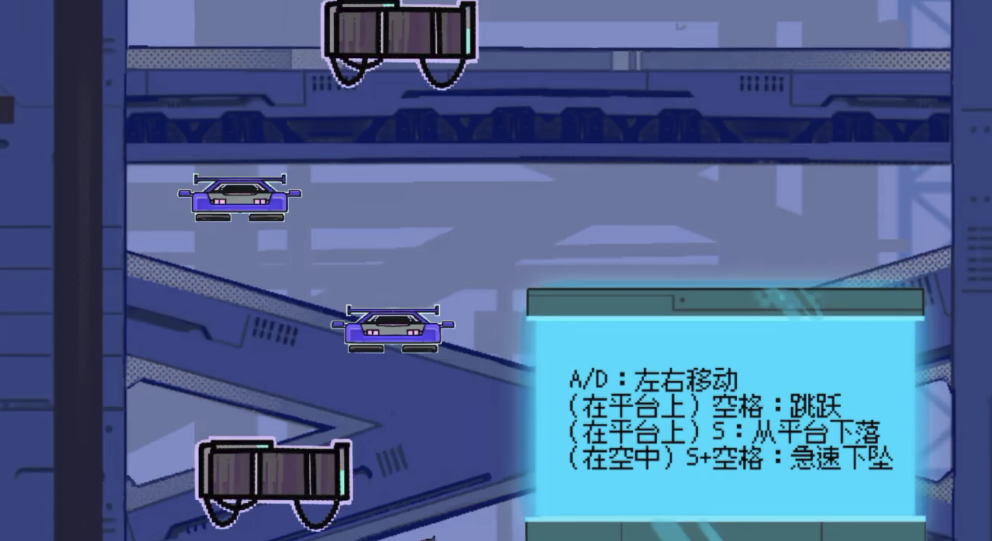
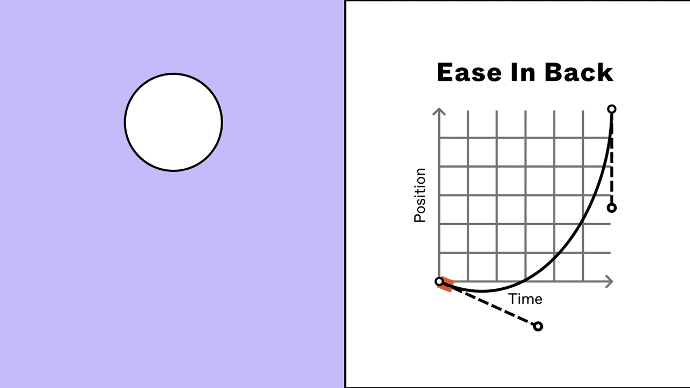
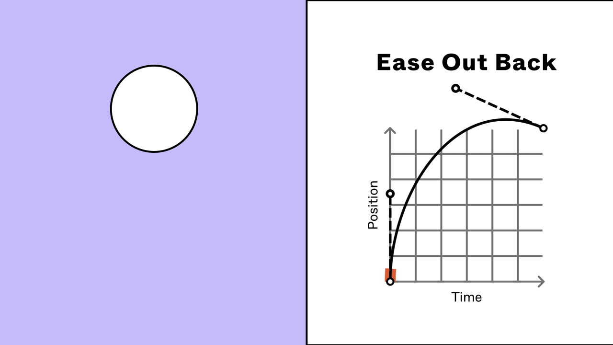

## 前言

也许你会绘制漂亮的人物立绘、场景或概念图，但我在这里要表明的一个核心的观点是

> 绘画 ≠ 游戏美术

对于有成为游戏美术意愿或本来就会画画或建模的同学，首先明确自己的目的
* 想要在绘画或建模上进行单方面的精进
* 为游戏制作可用的美术资产
注意这两个方面有一定的共同点，但有**本质性**的区别：
* 前者需要一定的理论知识的学习和大量的练习，进行肌肉记忆和思维方式的锻炼等
* 后者则并非一定需要具有较好的绘图能力，但需要对游戏的制作流程、游戏的表现力分析有一定的了解

而共同点则在于自身的**审美**，这是**很重要**的一点，这方面需要看大量的书籍，艺术作品，视频来提升。不过这不是本文的重点所以就简单提一嘴。
同标题，本文则主要聚焦于后者。
#### 本文写给以下朋友：
**开始开发游戏，准备和程序配合的美术同学**
**多次进行游戏开发，并参与美术制作，但最终成品始终缺乏”感觉“**

接下来，我会用**游戏程序的视角**，帮你把最容易掉坑的点一条条捋顺，让你制作的美术资产真正“长在游戏里”，而不是只停留在画板上。

这一系列内容，包括考虑分辨率、文件格式、UI 尺寸、动画帧率、粒子效果等一系列的细节，如果一开始没做好，后面程序接入、打包、适配都会踩坑，改图会改到怀疑人生

## 美术资源交付

我们直接从交付资源说起，这是和程序交接的开始

交付美术资源，并非单纯的**把图片或模型发给程序**，我见过的最糟糕的资源协同方式就是使用QQ微信直接传群里。这种看似直观简单的方式，实际上暗藏雷区

**版本容易混**
* 临时改了一点颜色，调整了一下大小，就又往群里丢一张
* 程序同学当时正忙，只口头答应“收到”，结果根本没下最新文件。
* 等到打包前几分钟才发现： *“这个图怎么还是用的老版本的？！”*

**信息被聊天淹没**
* 群聊里有梗图、讨论记录、其他文件，你的“重要小调整”很快被刷走。
* 回头想找最新版，却不知道埋在哪 500 条消息之前。&#x20;

**缺乏流程追踪**
* 谁改了什么？什么时候更新？有没有替换成功？——完全没记录。
#### 所以有一个合适的资产管理方案是重中之重

* 一个比较简单的方案是使用共享云盘：飞书共享文件夹，Google Drive等，并在云文档中统一文件夹结构以及版本号命名，并管理一个更新表格，每次在云文档中有增删改，都记录一下，以便程序查漏补缺及时跟进。

* 而更好的方式则是使用更加专业的协同工具，如Git，SVN等，具有自动记录历史，记录人员，随时回退等优点，虽然具有一定的学习成本和上手门槛，但现在有更容上手的可视化工具，上手并不困难，且微小的学习成本能换来巨大的效率提升

## 图像规格

### 尺寸

* 过大的图片
对于许多艺术生的同学来说，有对细节的极致要求，在绘制美术素材时，会将图像大小设置得无比巨大，我亲眼见过一个png文件高达几十mb，一个psd高达1g.

大的图片确实能让图像更加的精细，能容纳更多的细节，但对于游戏来说，需要考虑性能等多方面因素：
* 过大的图片会导致游戏的加载变慢
* 导致游戏包体变大
* 如果做开发的程序员没有一个强劲的电脑，也会导致在开发时卡顿，造成极大的不便。

那么当你以美术身份参与游戏开发，就需要在**性能表现和艺术表现**寻求一个平衡。
* 合理的规格

在许多美术制作软件中，通常会有画布的概念，使用者可以为画布设定大小，那么此时就需要注意**画布的单位**，在众多软件中，画布的单位有厘米，英寸，像素等，而对于显示器来说，他只认**像素**单位，显示器在显示的层面上，是不认我们现实世界中的物理单位的，如果你以物理单位导出图像，那么他会根据一个转换值，将物理单位转换为像素单位，这也是大部分美术出图会巨大无比的原因，所以在导出资产时，一定要注意导出时的单位设置

以最常见的设备分辨率来说，我们常用的显示器都以16:9显示，分辨率一般设定在1920px×1080px（px指**像素**），那么任何图像都可以以此为基准进行绘制，当然也可以使用更高的分辨率，例如2560×1440，也就是俗话说的2k分辨率，同样也是一个16:9的这样常见的比例规格。

当然如果要适配一些手机或特殊的屏幕比例（例如近年笔记本比较流行的16:10）,那么对于背景图这种需要铺满整个屏幕的素材就应该考虑对其扩充一些可供裁剪切裁剪后而不影响美观的区域，来保证图像的适配

游戏的素材应尽量保持以固定的分辨率为基准来设计和绘制，例如游戏的背景图绘制的大小为1920×1080，那么场景中的小物件就应该不应该绘制一张1080×1080的图然后让程序在引擎中缩小比例（除非这个物件设计如此就该这么大），总而言之这样一个原则就是：在基准的分辨率下，图该多大，就画多大，避免让程序在引擎中缩小或放大图像的比例。

### 锚点

在我与一些第一次做游戏的美术同学合作时普遍会出现这样一种问题：对于一些类似背包物品、道具栏物品等，或者是在场景中会根据玩家的交互或游戏系统的运作而变化的贴图（我们称之为Item），大部分同学所绘制的贴图尺寸有一定的问题，大都出在绘制的图片尺寸不统一，比例不统一等，在替换时，贴图看起来就会有所偏移。

这个问题最根本的在于这样一个概念：锚点。

一张图片有不同的尺寸，有的很大，有的很小，像素作为单位，但在计算机程序中，表示一张图在屏幕上显示的位置只能是一个点，这个点我们就称之为锚点。

在游戏引擎中，开发者可以任意定义锚点在图片的哪个位置，一般取四个角的位置或中心点。在一般的情况下，一些静态的UI图，需要开发者手动拼接的图可以不用太关心锚点的位置问题，但是对于像上述动态的“Item”就需要统一规范，因为程序已经定死了Item的位置，来对应图片锚点的位置，动态替换的贴图就需要保证统一的锚点。

没有实际接触过的话看起来可能还是会有点绕，不过也不必细究，对于Item这样的贴图素材，保证这一类的贴图图片大小完全一样即可这样一个原则即可。

## UI制作

### 字体

游戏中会存在大量的文字信息，为了贴合美术风格，通常会选用一定的字体来设计游戏的文字信息。一般，只需要在将字体的ttf或otf文件发给程序同学，并标注在基准设计分辨率（前文图像规格提到）的设计前提下的字体大小，以及描边等信息。当然，更好的方式是使用一些方便的设计软件（例如Figma，Pixso，XD等，下文的排版也推荐使用类似的软件）

当然，一般来说，嫌麻烦的话直接给程序同学发字体文件就行

### 排版

在基准的设计分辨率下，UI的排版需要美术同学来指定，在开发时，经常会有这么一个情况：美术给程序同学发一堆美术素材，配了一个简单示意图，然后程序同学就在引擎里面拼接。后来双方开始对接，美术同学就提各种需求，xx按钮往左一点、xx图片放大一点......这样的协作是十分低效和耗费精力的。如果后来UI素材有替换，那么这样的过程还会再来一次。

一般来说，对于这种情况美术同学需要在前面说的敲定一个基准的设计分辨率的前提下指定UI元素的边距，简单举个例子就是，某个按钮是放在左上角的，那么就指定这个按钮的上边界距离屏幕的上边界多少像素，按钮左边界距离屏幕的左边界多少像素。

保持一个固定的边距，那么在程序中也会让图片遵守这样的一个“规则”，即使屏幕分辨率并非是设计分辨率，也会让图片保持这样一个边距。

对于排版这方面，也推荐使用Figma这类软件来进行设计和排版，程序同学通过这类软件，可以轻松的看到UI元素的边距等信息

## 理解动态

动态是提升游戏的质感的关键一环，但这方面往往在开发的中后期才会开始制作，也就是常说的打磨阶段。以往与很多制作毕设的美术同学合作时，往往因为拖延的问题，导致游戏赶在DDL前几天甚至几个小时才草草完工，到最后没有时间打磨看似功能似乎没什么问题，游戏也能按计划完整运行，但是总觉得会缺少一点“感觉”，这种“感觉”就是游戏中的动态。要明确的一点是：**画**只是表现动态的第一步。

### 缓动

UI面板的弹出，鼠标悬浮在按钮时的放大缩小，物体的移动，这个变化如果是瞬间完成的，那显然就会显得生硬，我们需要为其添加一个渐变的过程，这个行为我们就称之为缓动。

**缓动函数**用一条曲线描述“随时间推进，属性变化的速度。

以下是一些缓动曲线的例子（GIF素材出自Figma,Figma制作交互原型时也可以设置相应的缓动曲线）

通过缓动，让物体真正产生运动的感觉，缓动给动作加上“呼吸”和“重量”

### 特效

美术同学擅长在自己的绘画中表达情绪，而特效是游戏情绪的放大器，而在全是动态与交互的游戏中，情绪的放大器更是不可少的一环。特效的本质在于以动态的方式直观的告诉玩家，这里发生了什么，这里应该是什么感觉，把物理上不存在的，能量，情绪，事件变得**可视化**

即使对于人少且时间紧迫的开发团队，也不能忽视特效的作用，制作特效需要程序和美术的沟通以下是一个简单的制作特效的步骤：
* 确定目标：确定要表达的情绪，寻找参考。
* 拆解：拆解特效的构成，分解动作流程。
* 素材制作：根据拆解内容，列出素材制作表格，完成素材制作。
* 实装：程序整合美术素材，必要时编写一定的Shader效果，制作特效。
* 调整参数：最后的优化

总而言之，制作特效这个步骤，是需要多方面职能共同参与的，且最终效果都需要在经手引擎使用者来呈现。需要注意的是，这方面的制作应该在游戏制作的中期就应该开始，否则最终会来不及制作动态而导致游戏有一种廉价感。

### 粒子

粒子也可以算是一种特效，粒子是一种表现微小群体运动的视觉元素，大量小型图片（粒子）按照一定规律和轨迹生成与消失，表现烟雾、火花、雨雪、魔法、尘土等分散而细碎的视觉效果的工具，大量粒子组合后形成的视觉感受就是粒子特效

粒子效果有助于提升游戏潜在的氛围感，让玩家感受游戏的动态变化，简单来说，粒子特效就是把碎片元素（烟、火、星尘等）组织起来，形成美观而自然的视觉效果。

其制作步骤也和上述的特效类似。

### 反馈

反馈的核心在于，让玩家明确感受到动作的结果，使每个操作都“真实而可信”，告诉玩家：“你的操作起作用了！”
* **按下按钮** → 按钮变色、播放点击声。
* **攻击敌人** → 敌人闪红、屏幕震动。
* **拾取物品** → 飘出物品名称、播放拾取音效。
* **开始跑步** → 脚下飘出烟尘粒子。

显然，给予玩家反馈，就需要我们上文说到的缓动，特效，粒子（当然，肯定还不止这些）。换句话说，给予了玩家足够的反馈，玩家才能更直观的感受到游戏带给玩家的情绪，玩家才会认可游戏的真实性，而并非单纯的提高游戏的精细程度

## 场景搭建

场景搭建是美术素材整合的重要一环，以下内容明确了**背景图**与**小物件**两个部分的制作与导出规范，确保美术资源能被程序顺利接入并高效运行。

### 背景图

背景图常在2D横板游戏中出现，也是新手开发者最常制作的类型。背景图是场景的基础画面，用于表现场景氛围、空间感和整体基调。首先要注意的是，背景图需要适配常规的设备比例（上文图像规格有所提及）。背景图也不应该过于巨大，这种情况最好是使用循环图（下文有所提及）

首先要注意的是，背景图需要适配常规的设备比例（上文【图像规格】有所提及）。其次，背景图也不应该过于巨大，如果一张背景图就占了几十MB，那加载时间会让玩家崩溃的。这种情况最好是使用循环图（下文有所提及）或通过分层来优化。

**分层**
一个常见的做法是“分层导出”。与其交付一张压平了所有元素的完整背景图，更合适的方式是将背景拆分为多个图层，例如：
* 远景（天空、远山）
* 中景（建筑、树林）
* 近景（灌木、栏杆）
将这些图层作为独立的、png文件交给程序。这么做的好处在于：
1. **实现视差滚动**：当游戏镜头移动时，程序可以让近景比远景移动得更快，从而营造出非常强烈的空间感和深度，这是提升**游戏感**的经典技巧。
2. **灵活插入元素**：角色可以在中景和近景之间穿行，一些特效或动态元素也可以被灵活地插入到不同图层之间，让世界看起来更具有可信度。
3. **资源复用**：天空、远山这些图层可能在多个场景中都能被复用，有效减小游戏包体。
所以，在动手画背景前，最好先和程序沟通好场景的景深和层次需求，这能避免后期不必要的返工。

### 小物件

这是一个很简单但很常见的问题：以往与美术同学协同开发时，有一些新手美术同学会将所有场景的小物件，比如树、箱子、路灯等，全都画在背景图上，然后一张图发过来。

这种做法在静态插画里完全没问题，但在游戏里，这就是一个。因为在程序看来，那张图就是一张没有生命的“贴图”，游戏角色要么被整张图挡住，要么从所有物体前面穿过，我们无法实现**交互**

一个能与玩家互动的世界，是由无数个独立的小物件构成的。因此，正确的做法是：

* **独立导出**：场景中所有可以被角色遮挡、可以互动、或者需要重复使用的小物件（我们称之为“道具”），都应该从背景中分离出来，导出为独立的PNG文件。
* **留足透明区域**：导出的图片应该只包含物件本身，其余部分为透明。
* **统一锚点/轴心**：这又回到了我们前面提过的“锚点”概念。为了让程序能方便地把这些小物件放置在在场景里，你需要建立一个统一的规则。最常见的规则就是，让所有物件的“落地点”（比如树根、箱子底部）都对齐在导出图片的底部中心。这样程序在放置时，只需要关心坐标，而不用为每个物件去手动调整高度，极大地提升了效率。
* **清晰命名**：请使用`Tree_01.png`, `Box_Small.png` 代替`图层_1_副本.png`;

简单来说，背景图是“舞台”，而小物件是舞台上的“演员”和“道具”。只有把它们分开，这个舞台才能演一个生动的戏。

## 序列帧

序列帧通常用来循环播放一组图，来达成动画的效果，这一组图需要具有以下特征：
* **尺寸统一**：动画的每一帧（每一格小图）都应该具有完全相同的尺寸。
* **排列规整**：所有帧需要整齐地排列在一张大图上，通常是按行或按列排布，我们称之为“精灵图” (Sprite Sheet)。
* **信息清晰**：交付给程序时，需要明确告知这张序列帧总共有几行几列，以及总帧数和播放速度的建议（例如，每秒播放几帧）。

#### 为什么不推荐直接给一堆独立的图片文件？

这是出于性能的考虑，在游戏引擎中，一次性加载一张大图，然后由程序去切分播放，远比加载几十张零散的小图性能要好。这么做能有效减少游戏的加载时间和内存占用

## 循环图

循环图，也叫无缝贴图 (Seamless Texture)，是解决大面积重复纹理的“神器”，比如草地、砖墙、水面，或者2D游戏里无限滚动的背景。

它的核心在于，一张图的**上边界可以和下边界完美拼接，左边界可以和右边界完美拼接**，没有任何可见的接缝。

如果你直接用一张普通的草地照片去平铺，很快就会发现边缘有明显的“格子感”，非常出戏。而循环图的设计就是要消除这种不自然的感觉
